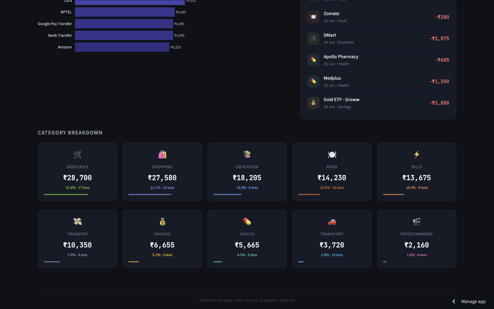

# 💸 AI-Driven Personal Finance Manager

> A fully automated, agentic expense tracking system that works through Telegram — no app to open, no form to fill. Just send a message, photograph a receipt, or ask a question in plain English.


---

     

## What It Does

Most people do not track their expenses — not because they do not want to, but because every existing tool requires too much effort. Opening an app, selecting a category, typing an amount, hitting save. That friction is enough to make the habit fail within a week.

This project removes the friction entirely. Your Telegram bot is always open on your phone. You spend money, you send a message. That is all.

The system handles three types of input automatically:

**Text messages** — You type naturally, the way you would message a friend.
```
"Zomato biryani 280 today"
"Paid 1200 at BigBasket yesterday"
"Auto to office 85"
"Netflix renewal 649"
```
The AI reads this, pulls out the amount, merchant name, category, and date — even when the date is relative like "yesterday" or "last Tuesday" — and saves a clean structured record to the database.

**Receipt photos** — You photograph any bill, printed receipt, digital invoice screenshot, or handwritten note. The vision AI reads the image, extracts the total amount, shop name, and date, and saves it. You do not type anything.

**Natural language questions** — You ask your spending data questions the same way you would ask a person.
```
"How much did I spend on food this month?"
"What was my biggest expense last week?"
"Show me my top 5 merchants"
"How much on transport in June?"
"Compare my food spending to groceries"
```
The AI generates a SQL query from your question, runs it against your personal database, and replies with a plain English answer — not a table of raw data, an actual human-readable response.

Everything lands in a live Streamlit dashboard with charts showing monthly trends, category breakdowns, top merchants, and recent transactions. The dashboard has a public URL you can open on any device.

---

## Architecture

The system is built as a multi-branch automation workflow on n8n Cloud with three parallel processing paths — one for text, one for photos, and one for queries. All three branches write to the same Supabase database and read from the same dashboard.

```
 User sends message on Telegram
          │
          ▼
 ┌─────────────────────────────┐
 │   n8n Telegram Trigger      │  Fires on every incoming message
 └─────────────┬───────────────┘
               │
               ▼
 ┌─────────────────────────────┐
 │   Check Message Type        │  Switch node — detects message format
 └──────┬──────────────┬───────┘
        │              │
   [text/query]    [photo]
        │              │
        ▼              ▼
 ┌────────────┐  ┌─────────────────────────────────────────────┐
 │   Detect   │  │  Get Photo File (Telegram node)             │
 │   Intent   │  │  → Build Download URL (Code node)           │
 │            │  │  → Download Photo (HTTP Request)            │
 │ LOG/QUERY? │  │  → Extract URL from binary metadata         │
 └─────┬──────┘  │  → Groq Vision — llama-4-scout-17b         │
       │         │    reads the receipt image                  │
  ┌────┴────┐    │  → Parse JSON response                      │
  │         │    │  → Save to Supabase                         │
 LOG      QUERY  │  → Send confirmation to Telegram            │
  │         │    └─────────────────────────────────────────────┘
  ▼         ▼
┌─────┐  ┌──────────────────────────────────────────┐
│Build│  │  Build SQL Query (Code node)             │
│Groq │  │  → Ask Groq for SQL (HTTP Request)       │
│Prmpt│  │    llama-3.1-8b-instant writes the query │
└──┬──┘  │  → Parse SQL response                    │
   │     │  → Execute SQL on Supabase Postgres       │
   ▼     │  → Format Answer (Code node)              │
┌──────┐ │  → Send answer to Telegram                │
│Groq  │ └──────────────────────────────────────────┘
│llama │
│extrc │
└──┬───┘
   │
   ▼
┌─────────────────────┐
│  Parse JSON         │  Cleans and validates extracted fields
│  Response           │
└──────────┬──────────┘
           │
           ▼
┌─────────────────────┐
│  Save to Supabase   │  Inserts row: amount, merchant,
│  (transactions)     │  category, date, note, source
└──────────┬──────────┘
           │
           ▼
┌─────────────────────┐
│  Send Confirmation  │  Telegram reply with formatted summary
│  to User            │  ✅ Saved! ₹280 · Zomato · Food
└─────────────────────┘

           All paths write to the same database
                         │
                         ▼
              ┌──────────────────────┐
              │   Supabase           │
              │   PostgreSQL         │
              │   transactions table │
              └──────────┬───────────┘
                         │
                         ▼
              ┌──────────────────────┐
              │   Streamlit          │
              │   Dashboard          │
              │   (public URL)       │
              └──────────────────────┘
```

**Key design decisions in the architecture:**

The intent detection step is what makes the system feel natural. Without it, you would need to use commands like `/log` or `/query` to tell the bot what to do. Instead, a pattern-matching Code node analyses the message text — looking for question words, time references, amount patterns, and merchant names — and routes the message to the right branch automatically.

The photo branch avoids base64 conversion entirely. After discovering that n8n Cloud stores binary files externally as filesystem references rather than in-memory data, the system was redesigned to extract the actual Telegram file URL from n8n's binary metadata and pass it directly to Groq Vision. Groq fetches the image from the URL itself — no conversion, no size limit issues.

The query branch generates SQL dynamically. The system prompt given to Groq includes the exact table schema, category names, and strict rules about aliasing aggregate functions (`SUM` must be aliased as `total`, `COUNT` as `count`) so the response formatter can reliably parse and display the results.

---

## Tech Stack

| Component | Technology | Purpose |
|-----------|-----------|---------|
| Chat Interface | Telegram Bot API | User-facing input and output |
| Automation | n8n Cloud | Workflow orchestration, 26 nodes |
| Text LLM | Groq `llama-3.1-8b-instant` | Transaction extraction, SQL generation |
| Vision LLM | Groq `meta-llama/llama-4-scout-17b-16e-instruct` | Receipt image reading |
| Database | Supabase PostgreSQL | Transaction storage and querying |
| Dashboard | Streamlit + Plotly | Data visualisation |
| Language | Python 3.11 | Dashboard code |

---

## Use Cases

**Personal daily expense logging** — The primary use case. Someone who wants to track spending without changing their behaviour. The Telegram bot is already open for messaging — logging an expense becomes as easy as sending a message.

**Receipt archiving** — Useful for reimbursement tracking, tax purposes, or warranty records. Photographing a receipt immediately after purchase captures the data before the paper fades or is lost.

**Spending awareness** — Many people have no idea how much they spend on specific categories until they see it visualised. The query interface lets someone ask "how much did I spend on Swiggy this month?" and get an honest answer immediately.

**Budget retrospectives** — At the end of a month, the dashboard shows exactly where money went — which categories exceeded expectations, which merchants got the most business, and how this month compared to the last.

**Small business expense tracking** — A freelancer or small business owner can use this to log client-related expenses in real time and query totals by category for invoicing or tax filing.

**Indian UPI context specifically** — Every UPI payment triggers a bank SMS and sometimes a notification. This system can receive those forwarded messages and extract the transaction automatically — turning what is already happening (the bank alerting you) into structured financial data with zero additional effort.

---

## Privacy and Data Handling

**What this project stores:**
Each transaction record contains: amount, merchant name, category, date, a copy of the original message text, and whether it came from text or a photo. Nothing else.

**What it does not store:**
Account numbers, IFSC codes, bank names, card numbers, CVV, PINs, balances, or any identifying financial credentials. These never enter the system.

**Where data lives:**
All data lives in your own Supabase project — a PostgreSQL database that you own and control. It does not pass through any third-party storage. n8n Cloud processes messages in transit but does not retain them after workflow execution.

**The AI APIs:**
Transaction text and receipt images are sent to Groq's API for processing. Groq's free tier may use inputs to improve their models. For a production version handling real sensitive data, the Groq paid tier should be used, which comes with a data processing agreement that excludes training use.

**The Telegram bot:**
Your Telegram bot is private — it only responds to messages from your personal Telegram account. There is no public access.

**The dashboard:**
The Streamlit dashboard is public by default when deployed on Streamlit Cloud. It shows spending patterns and amounts but no personally identifying information. If privacy is a concern, Streamlit supports password-protected deployments.

---

## Known Limitations and Honest Flaws

**This project currently uses dummy data, not real bank transactions.**
The 100 transactions in the database were synthetically generated — realistic Indian merchants, amounts, and categories, but not real personal financial data. The reason is privacy: uploading a real bank statement PDF to an AI API is a genuine security risk. The system is architecturally ready for real data — it just needs a safe input method.

**Manual logging requires discipline.**
Even though sending a Telegram message is easy, it still requires remembering to do it after every purchase. For categories like groceries or dining, where multiple small transactions happen quickly, a few will inevitably be missed. The system tracks what you tell it, not what you actually spend.

**Intent detection is pattern-based, not perfect.**
The router that decides whether a message is a LOG or a QUERY uses keyword matching and regex patterns. Edge cases exist — a message like "spent too much on Swiggy" might be misclassified as a query because of the word "spent". The system handles common cases well but not every possible phrasing.

**SQL generation can fail on complex questions.**
Asking "compare my food spending this month to the same month last year" requires a more complex query than the system reliably generates. Simple aggregations (totals, averages, top N) work consistently. Multi-step analytical questions sometimes produce incorrect SQL.

**Receipt scanning accuracy varies.**
Groq Vision reads clear, well-lit receipt photos accurately. Crumpled receipts, poor lighting, handwritten bills, and receipts in regional languages other than English reduce accuracy significantly. The system falls back to "Unknown / Other" when it cannot parse a receipt clearly.

**No real-time bank integration.**
This system does not connect to your bank account, UPI apps, or any payment provider. It only knows about transactions you explicitly log. Automatic bank statement parsing and UPI history imports were considered but excluded to avoid handling sensitive credentials.

**n8n Cloud free tier limits.**
n8n Cloud's free plan allows 5 active workflows and 2,500 executions per month. For light personal use this is sufficient. Heavy use or multiple users would require a paid plan or self-hosted n8n.

---

## Real-World Roadmap

The path from this portfolio project to a production-ready personal finance tool involves solving the limitations above one by one.

**Phase 1 — Real transaction ingestion (next immediate step)**
Integrate SMS forwarding from an Android device using a lightweight forwarder app. Indian banks (HDFC, SBI, ICICI, Federal, Axis) send SMS alerts for every debit transaction. Forwarding these to the Telegram bot would make logging fully automatic — every purchase is captured within seconds without any manual action.

**Phase 2 — Account Aggregator integration**
India's Account Aggregator (AA) framework, regulated by RBI, allows consented, real-time access to bank transaction data from all major Indian banks through a single standardised API. Services like Setu and Finvu implement this. Integrating AA would give complete, automatic, real-time transaction data without any SMS forwarding or manual input — the same technology that powers CRED, Fi Money, and Walnut. This is the professional-grade solution.

**Phase 3 — Voice note support**
Route `message.voice` from Telegram through Groq's Whisper API for transcription, then feed the transcript into the existing text extraction pipeline. Estimated implementation time: under two hours. Allows logging expenses by speaking naturally while driving, walking, or when it is inconvenient to type.

**Phase 4 — Budget alerts and anomaly detection**
Set monthly category budgets. When spending in a category approaches or exceeds the limit, the bot sends a proactive alert. Anomaly detection (unusual merchants, duplicate transactions, very large amounts) would flag suspicious entries for review.

**Phase 5 — Multi-user with Row-Level Security**
Add a `user_id` field to the transactions table, enable Supabase Row-Level Security (RLS) keyed on the authenticated user, and allow multiple household members to share one deployment while seeing only their own data.

**Phase 6 — Self-hosted deployment**
Move from n8n Cloud and Streamlit Cloud to a self-hosted setup on a small AWS EC2 or home server. This eliminates execution limits, removes third-party data processing, and allows full customisation. The entire stack (n8n, Streamlit, Supabase-compatible Postgres) can run on a $5/month VPS.

**Phase 7 — Mobile dashboard**
Replace or supplement the Streamlit dashboard with a lightweight mobile-optimised web app. The Telegram interface handles input well on mobile, but the current dashboard is desktop-first.

---

## Background

This project was built to demonstrate end-to-end AI engineering — specifically the ability to design and ship an agentic system that integrates multiple AI models, an automation platform, a database, and a visualisation layer into something a real person could actually use.

The specific problem (expense tracking) was chosen because it is universally relatable, has a clear gap between current solutions and ideal behaviour, and maps naturally to the technical capabilities being demonstrated: multimodal AI, natural language interfaces, intent detection, and autonomous data pipelines.

---

<p align="center">
  Built with ⚙️ n8n &nbsp;·&nbsp; 🤖 Groq &nbsp;·&nbsp; 🗄️ Supabase &nbsp;·&nbsp; 📊 Streamlit
</p>

